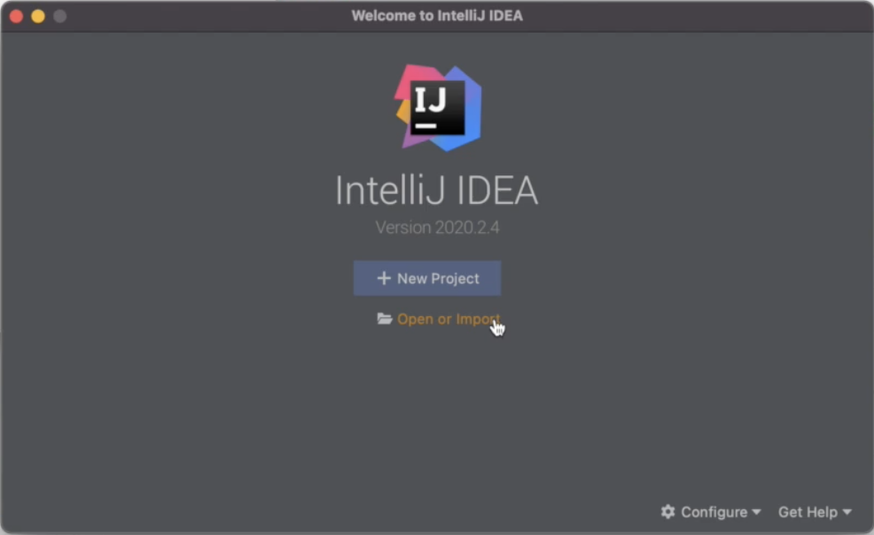
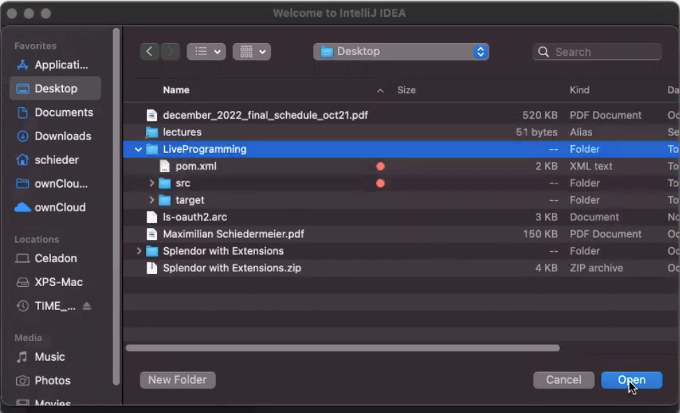
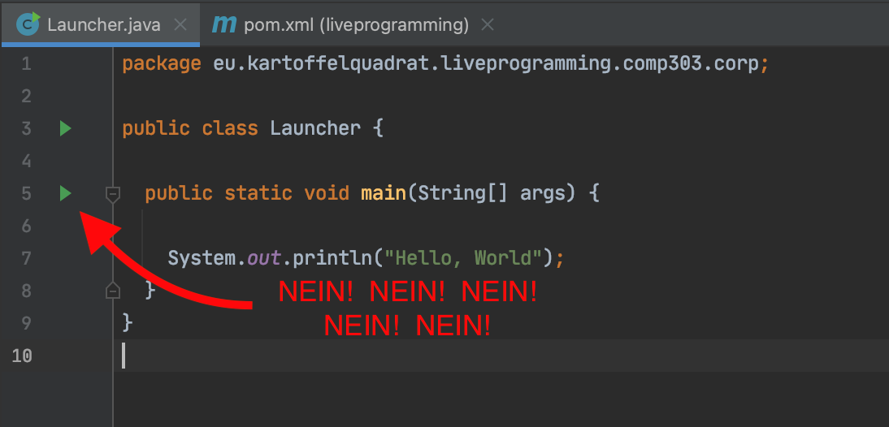
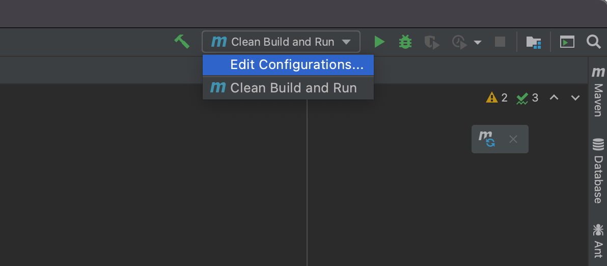
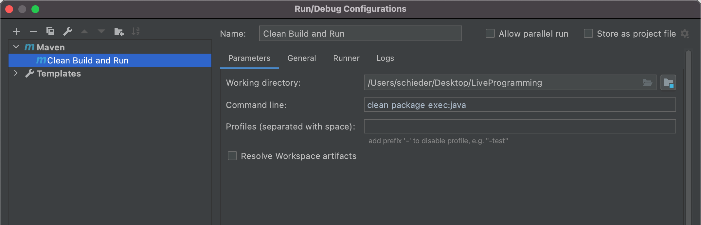
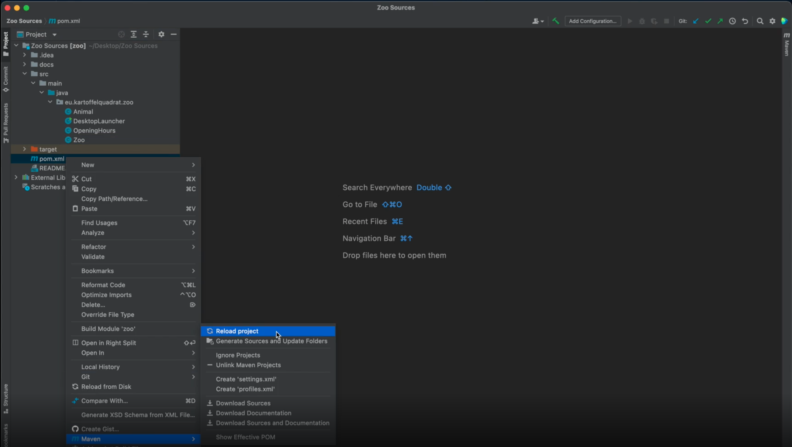
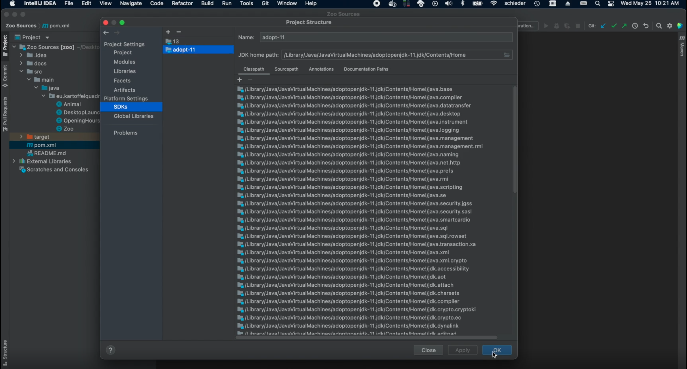
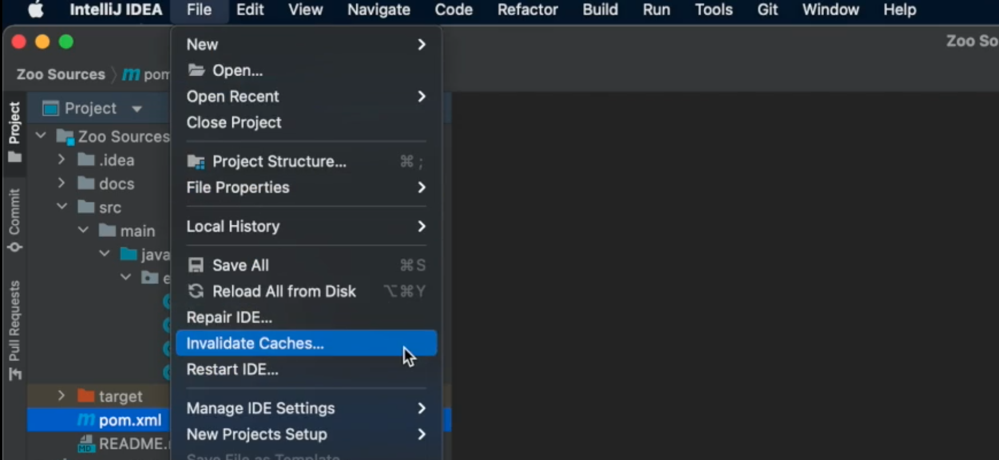
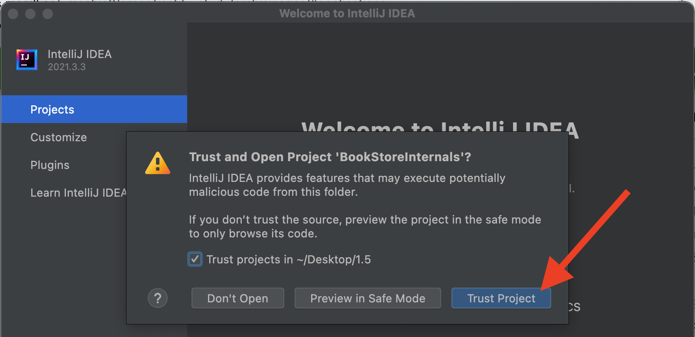

# IDE Integration

In this module I show you how to correctly set up a maven project in [IntelliJ IDEA](https://www.jetbrains.com/idea/download/).  
While IntelliJ supports Maven projects out of the box, however there are a few pitfalls.

## Open the right Folder

There are different ways to open a project, but the most reliable in my experience is to use the ```Open``` dialogue:



Next select **the root folder of your maven project**! Not ```src``` not any inner nested folder, select the ```root``` folder. That is **the folder containing your ```pom.xml```**.



Give IntelliJ a moment to index your project, there is a little progress bar in the top right. Then you should be good to continue.

## Link the pom File

The changes made to the ```pom.xml``` file might not be all be taken into account out of the box. If you see this popup in the top right corner, click the twirly arrows to keep your IDE in sync with the content of your ```pom.xml``` file.


## Set up a Run Configuration

When you open a class with a ```main``` method, IntelliJ will display little green triangles on the side bar. **DO NOT CLICK THOSE!**



If you do, IntelliJ will interpret and run your code, but it will do so without taking into account any of your maven plugin configurations. This is not what you want, you might as well not use Maven then.

Instead set up your own Maven-based run configuration:

 * Click the ```Edit Configuration...``` button in the top right.  

 * Add a *Maven Configuration*, use the desired run command, e.g. ```clean package exec:java```.  
Note the ```mvn``` keyword is implicit here.  



 > From here on the green triangle **next to your custom run configuration** automatically triggers the desired maven goals.

## Troubleshoot

 * **Q**: I open the project with IntelliJ, but everything is underlined in red.  
**A**: The projet was not correctly opened. There are multiple potential fixes:  
    Option 1) Reload ```pom.xml```: Right click the file, then select ```Maven -> Reload Project```.  

    Option 2) Verify the JDK version: Select ```File``` -> ```Project Structure...```. Verify ```11.0.5``` is selected in the *Project* and *SDKs* tab:  
  
  
    Option 3) Invalidate IntelliJ caches: Select ```File``` -> ```Invalidate Caches...```. Then select the first two checkboxes:  
  

 * **Q**: I cannot compile / run the project, the green button is greyed out.  
**A**: The project has no launch configuration by default, therefore the arrow in the top bar is not available. You have to create a maven run configuration first.
 * **Q**: I've modified the ```pom.xml``` file as shown, but IntelliJ still does not seem to know about any dependencies.  
**A**: Sometimes the changes made to the ```pom.xml``` are not automatically detected. (See first question, ```pom.xml```reload```.)
 * **Q**: IntelliJ asks me whether I want to trust the project sources. Should I?  
**A**: Yes. This is just a security mechanism to prevent malicious code being executed on project import. The provided sources are all from us and can be trusted.  
